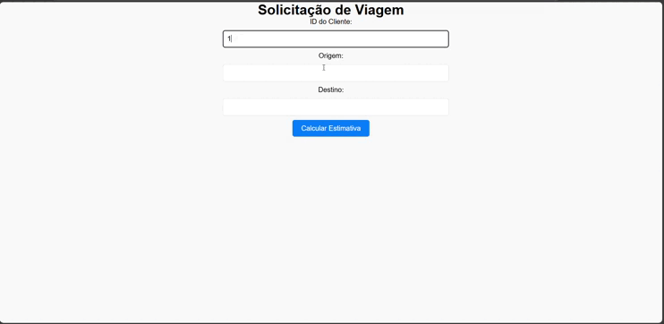

Ride Booking System é um projeto conceito desenvolvido para simplificar o processo de reserva de viagens de carro particular. O sistema oferece uma experiência eficiente e intuitiva para os usuários, permitindo a solicitação de viagens, escolha entre motoristas disponíveis e visualização do histórico de viagens realizadas.

🛠️ Tecnologias Utilizadas

Backend: Construído com Node.js, TypeScript, Fastify e Prisma ORM, garantindo uma API REST robusta e escalável.

Frontend: Desenvolvido em React, proporcionando uma interface amigável e fluida para os usuários.

Banco de Dados: Integrado com Postgres para persistência de dados eficiente.

✨ Funcionalidades

Solicitação de Viagens: Usuários podem reservar viagens de forma simples e rápida.

Escolha de Motoristas: Listagem de motoristas disponíveis no momento da reserva.

Histórico de Viagens: Visualização das viagens realizadas, com implementação de tipagem rigorosa em TypeScript.

🎯 Objetivos do Projeto

Demonstrar habilidades no desenvolvimento de um sistema completo com Node.js e React.

Utilizar práticas modernas como ORM Prisma, Fastify e TypeScript para criar uma solução performática e bem estruturada.

Proporcionar uma experiência de usuário eficiente e responsiva.

🚀 Como Rodar (Rápido)

Opção A — Local (recomendado, modo mock)
- Backend
  - `cp backend/.env.example backend/.env` (mocks já habilitados)
  - `cd backend && npm install && npm run dev` (http://localhost:8080)
- Frontend
  - `cp frontend/.env.example frontend/.env`
  - `cd frontend && npm install && npm run dev` (http://localhost:5173)

Opção B — Docker (modo mock)
- `docker compose up -d --build`
- Backend: http://localhost:8080 | Frontend: http://localhost

Dicas
- Modo mock não precisa Postgres nem chave Google.
- Para ver o mapa estático, defina `VITE_GOOGLE_MAPS_API_KEY` no `frontend/.env` (opcional).

Modo Real (opcional)
- Backend: defina `USE_MOCK_ROUTES=false`, `USE_MOCK_DRIVERS=false`, `USE_MOCK_DB=false`.
- Configure `DATABASE_URL` e `GOOGLE_API_KEY`, depois:
  - `cd backend && npx prisma migrate deploy && npm run seed`.

🖥️ Demonstração

  
  

